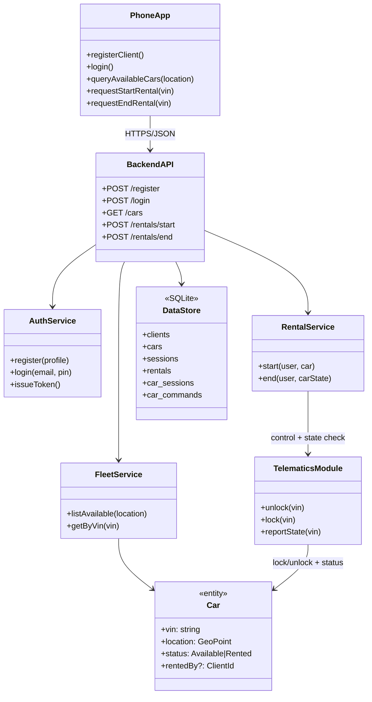
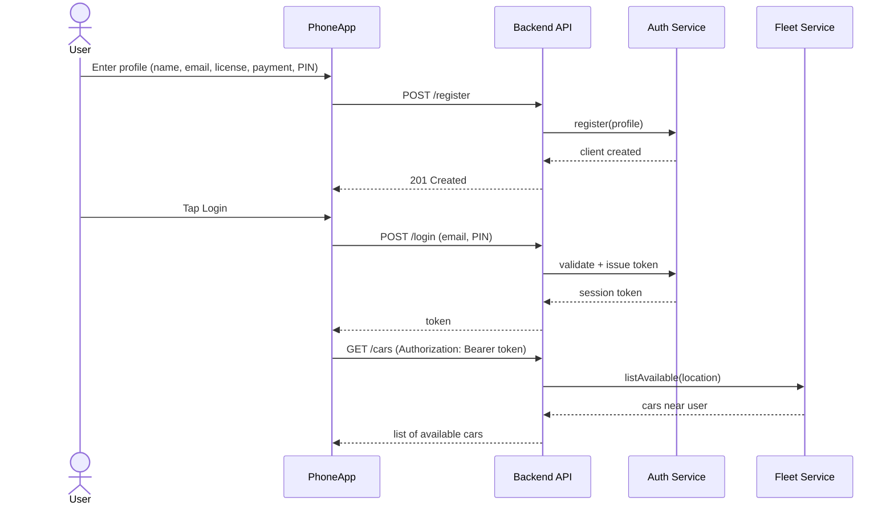
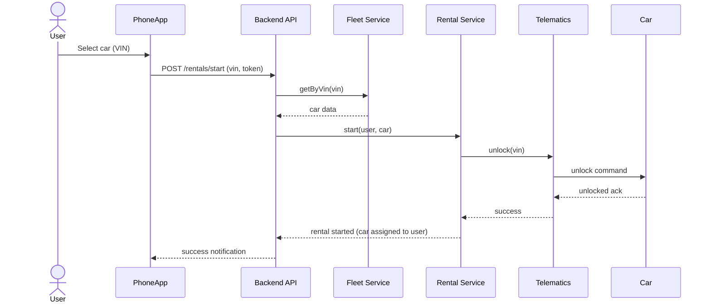
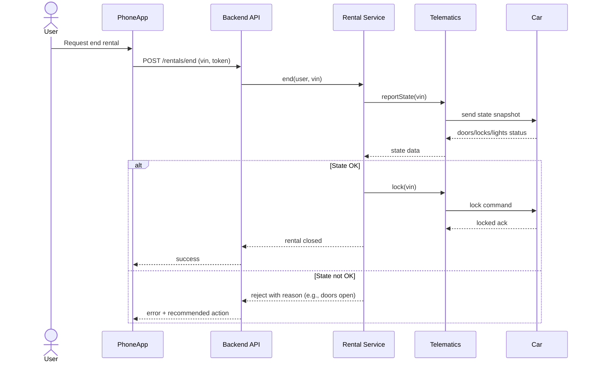

# CarSharing Architecture

This document captures a lightweight architecture for the car sharing prototype. It includes a class diagram and sequence diagrams that cover the main flows: login + query availability, start rental, and end rental.

## Rubric-oriented summary

- **Entities in system**: `PhoneApp`, `BackendAPI`, `AuthService`, `FleetService`, `RentalService`, `TelematicsModule`, `Car`, and `DataStore`.
- **Server**: `BackendAPI` (Flask service) is the central server and approval authority.
- **Clients**: `PhoneApp` (CLI/web UI) is the user-side client; the telematics side acts as a backend-integrated service endpoint for vehicle control/state.
- **Interfaces**: REST HTTP endpoints over JSON.
- **Messages exchanged**:
  - Register client (`POST /register`)
  - Login (`POST /login`)
  - Query cars (`GET /cars`)
  - Query own profile (`GET /me`)
  - Query own rentals (`GET /rentals/me`)
  - Start rental (`POST /rentals/start`)
  - End rental (`POST /rentals/end`)
  - Telematics update (`PATCH /cars/{vin}/telematics`)
  - Car client register (`POST /car/register`)
  - Car command polling (`GET /car/commands`)
  - Car command acknowledgement (`POST /car/ack`)
  - Car heartbeat (`POST /car/heartbeat`)

## Class diagram


## Sequence diagrams

### Login and query available cars


### Start rental


### End rental

```
