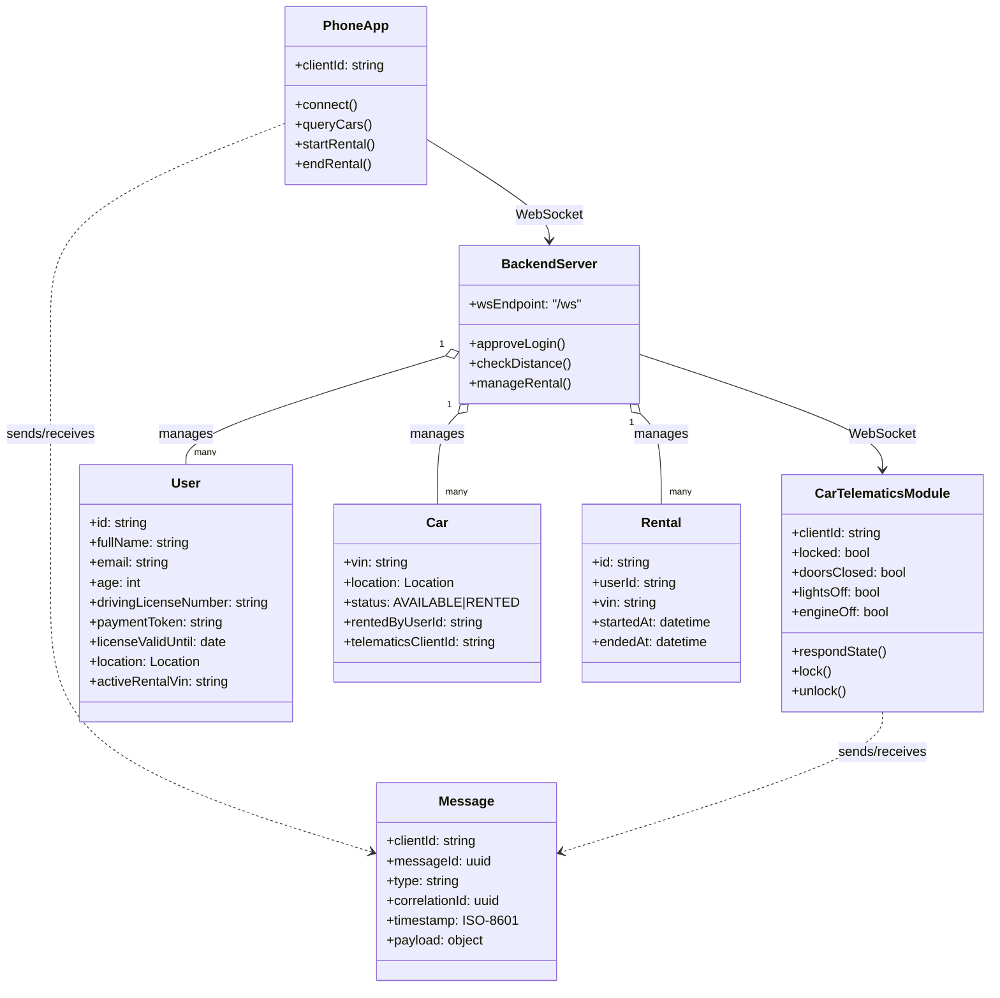

# Class Diagram

Core structure of the CarSharing system showing app, backend, and telematics components plus domain entities.
Highlights WebSocket dependencies via the shared Message envelope.
Depicts how the backend owns users, cars, and rentals with multiplicities.

