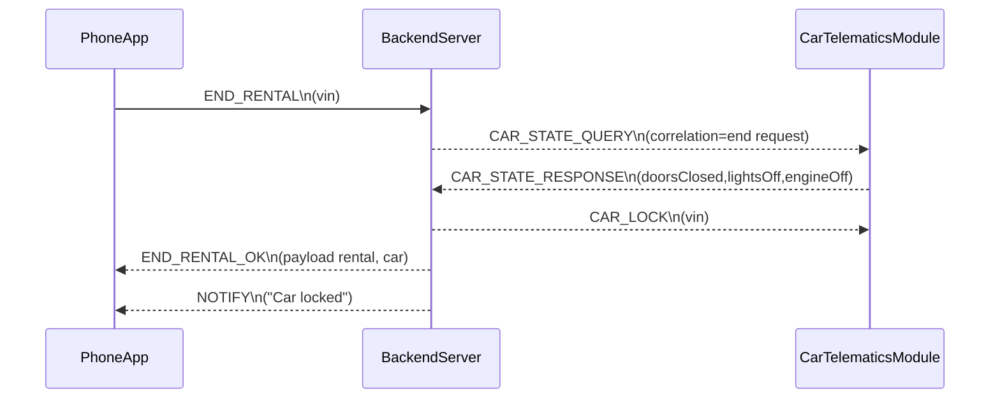

# Sequence End Rental Approve

Successful rental closure starting with END_RENTAL from the phone app.
Backend queries telematics for CAR_STATE_RESPONSE and verifies all safety flags.
Car is locked, then END_RENTAL_OK and NOTIFY confirm completion to the user.

