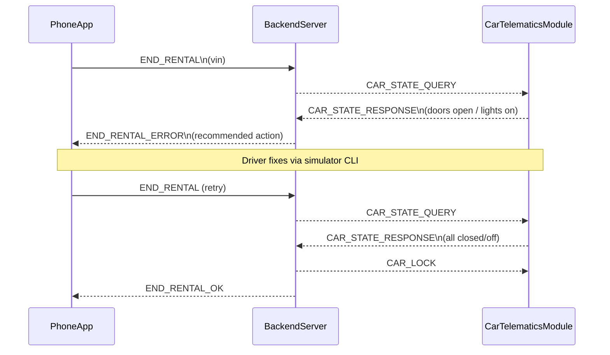

# Sequence End Rental Deny

Failure path for ending a rental when the vehicle is not secure (doors open, lights on, or engine running).
Backend returns END_RENTAL_ERROR with recommendations to the user.
After fixes in the simulator, a retry flows through to END_RENTAL_OK.

