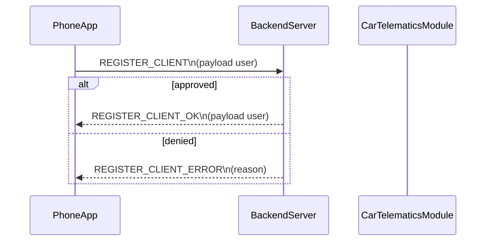

# Sequence Login

Registration handshake where the phone app submits user details to the backend.
Backend validates age and license, returning approval or denial.
All flows use the shared WebSocket channel and the REGISTER_* message types.

