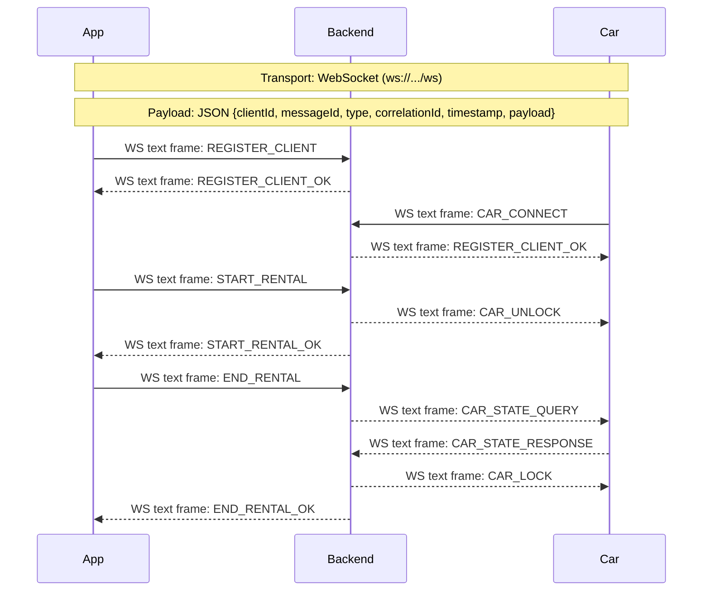

# Communication Protocol Overview (Slide)

```mermaid
sequenceDiagram
  participant App
  participant Backend
  participant Car

  Note over App,Car: Transport: WebSocket (ws://.../ws)
  Note over App,Car: Payload: JSON {clientId, messageId, type, correlationId, timestamp, payload}

  App->>Backend: WS text frame: REGISTER_CLIENT
  Backend-->>App: WS text frame: REGISTER_CLIENT_OK

  Car->>Backend: WS text frame: CAR_CONNECT
  Backend-->>Car: WS text frame: REGISTER_CLIENT_OK

  App->>Backend: WS text frame: START_RENTAL
  Backend-->>Car: WS text frame: CAR_UNLOCK
  Backend-->>App: WS text frame: START_RENTAL_OK

  App->>Backend: WS text frame: END_RENTAL
  Backend-->>Car: WS text frame: CAR_STATE_QUERY
  Car-->>Backend: WS text frame: CAR_STATE_RESPONSE
  Backend-->>Car: WS text frame: CAR_LOCK
  Backend-->>App: WS text frame: END_RENTAL_OK
```
