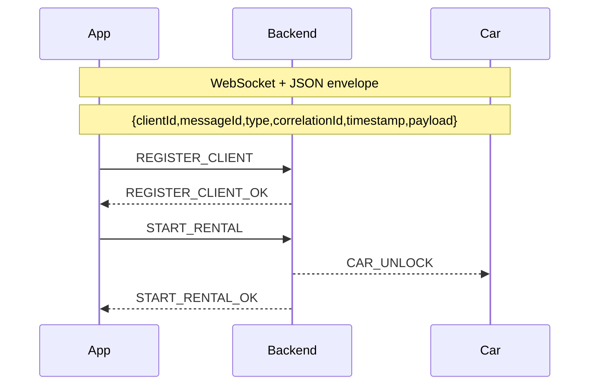

# Communication Protocol Overview (Slide)

```mermaid
sequenceDiagram
  participant App
  participant Backend
  participant Car

  Note over App,Car: WebSocket + JSON envelope
  Note over App,Car: {clientId,messageId,type,correlationId,timestamp,payload}

  App->>Backend: REGISTER_CLIENT
  Backend-->>App: REGISTER_CLIENT_OK

  App->>Backend: START_RENTAL
  Backend-->>Car: CAR_UNLOCK
  Backend-->>App: START_RENTAL_OK
```
