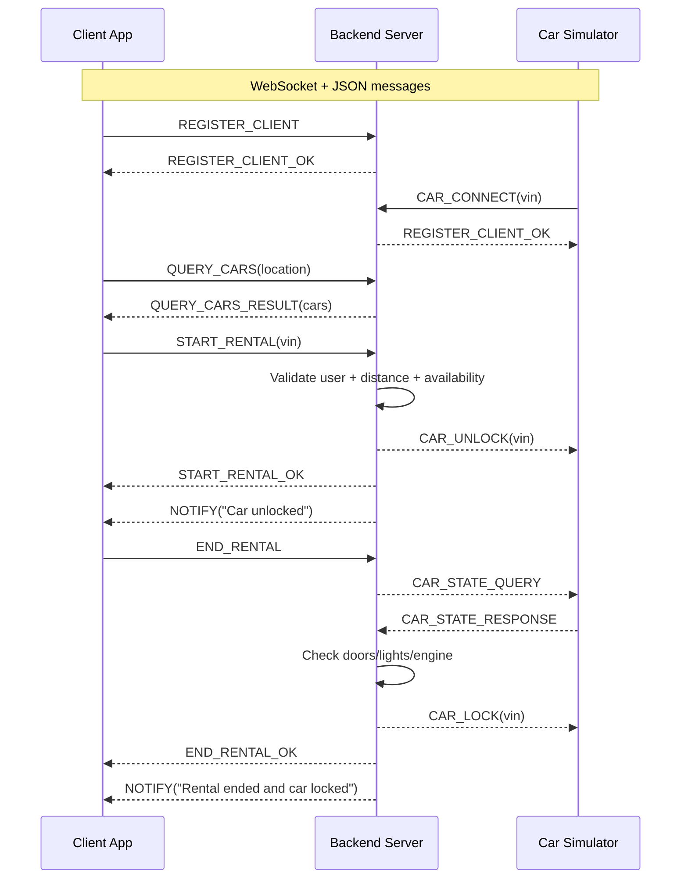

# Sequence Overview

End-to-end communication flow for the car sharing lab.

```mermaid
sequenceDiagram
  participant PhoneApp as Client App
  participant Backend as Backend Server
  participant Car as Car Simulator

  Note over PhoneApp,Car: WebSocket + JSON messages

  PhoneApp->>Backend: REGISTER_CLIENT
  Backend-->>PhoneApp: REGISTER_CLIENT_OK

  Car->>Backend: CAR_CONNECT(vin)
  Backend-->>Car: REGISTER_CLIENT_OK

  PhoneApp->>Backend: QUERY_CARS(location)
  Backend-->>PhoneApp: QUERY_CARS_RESULT(cars)

  PhoneApp->>Backend: START_RENTAL(vin)
  Backend->>Backend: Validate user + distance + availability
  Backend-->>Car: CAR_UNLOCK(vin)
  Backend-->>PhoneApp: START_RENTAL_OK
  Backend-->>PhoneApp: NOTIFY("Car unlocked")

  PhoneApp->>Backend: END_RENTAL
  Backend-->>Car: CAR_STATE_QUERY
  Car-->>Backend: CAR_STATE_RESPONSE
  Backend->>Backend: Check doors/lights/engine
  Backend-->>Car: CAR_LOCK(vin)
  Backend-->>PhoneApp: END_RENTAL_OK
  Backend-->>PhoneApp: NOTIFY("Rental ended and car locked")
```
