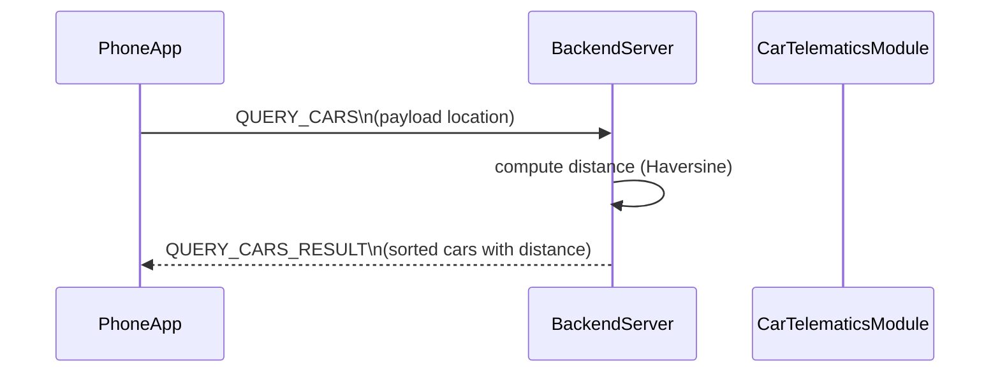

# Sequence Query Cars

Phone app requests nearby vehicles with QUERY_CARS and a location payload.
Backend filters AVAILABLE cars using Haversine distance and sorts them.
Results are returned via QUERY_CARS_RESULT on the WebSocket channel.

