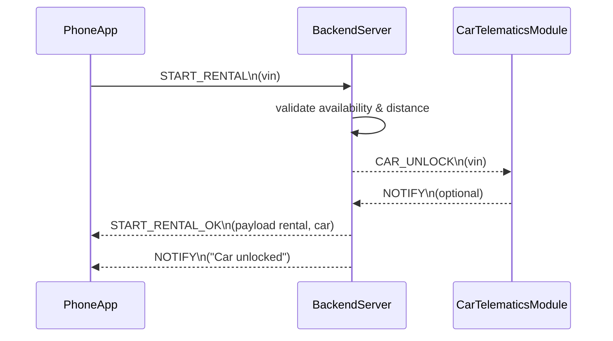

# Sequence Start Rental Approve

Happy path for starting a rental via START_RENTAL from the phone app.
Backend validates availability and distance, then unlocks the car through telematics.
Confirmation flows back with START_RENTAL_OK plus a NOTIFY message for the user.

