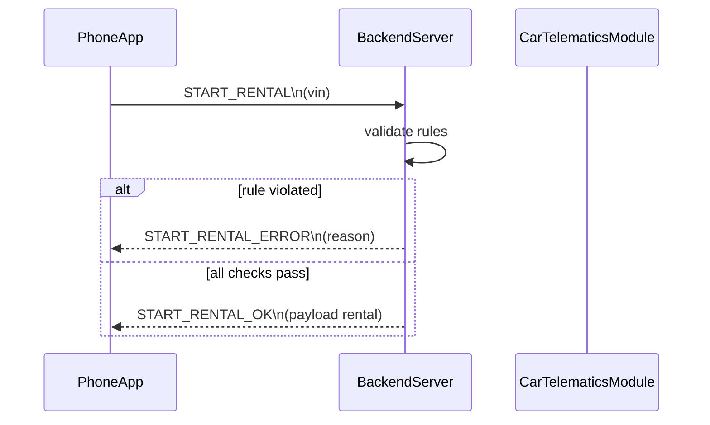

# Sequence Start Rental Deny

Failure branch for starting a rental when rules are broken (active rental, unavailable car, or distance > 2 km).
Backend returns START_RENTAL_ERROR explaining the denial.
Success branch shows the normal START_RENTAL_OK response when checks pass.

